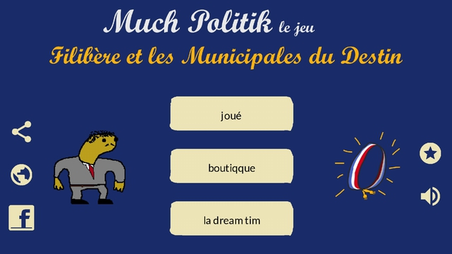
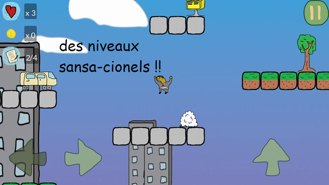
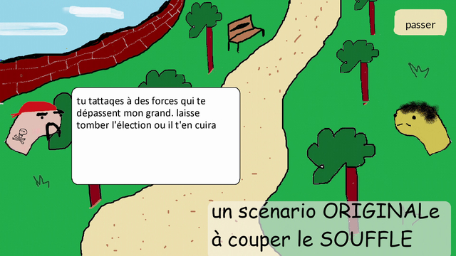
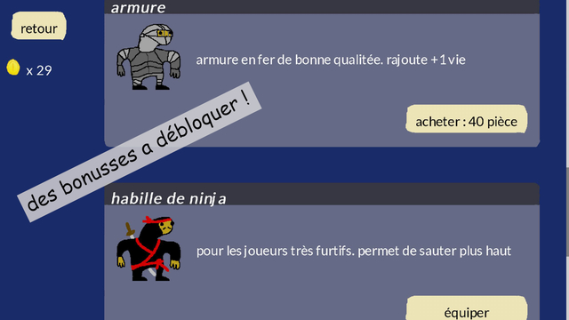

# MuchPolitik Le Jeu
 
This is the source code for *MuchPolitik - Le Jeu*, a funny 2D platformer game developed using open-source [libGDX](https://github.com/libgdx/libgdx), inside [MuchPolitik](http://www.muchpolitik.fr) satirical universe.

> Follow the adventures of Filibère Platipusse in a platform game to become mayor of the charming town of St-Gouzi-Gouzi! Defend your candidacy in a merciless world, and face your political opponents: Soviet communists, lawless anarchists, evil Nazis and bespectacled twittos.

In French:
> ✨ L'avanture or du comun du jeune Filibère Platipusse ! ✨
> 
> Suivée les avantures de Filibère Platipusse dans un jeu de plateforme pour devenir maire de la charmante ville de St-Gouzi-Gouzi ! Défendez votre condidature dans un monde sans mercille, et affrontez vos opposant politiqes : communistes soviétiqes, anarchistes sans foie ni loi, méchants nazilles et twittos à lunettes.

## Screenshots

## Download
- Android: The game is currently not available on Google Play Store, due to technical issues (todo)
- desktop (.jar): Download the [latest release](https://github.com/alxthm/muchpolitik-le-jeu-public/releases/download/1.0.2/desktop-1.0.2.jar) and simply execute the .jar file
- desktop (Steam): todo
- iOS: todo

## Contributors
- [Tarsi](https://www.tarsi.fr): script, graphics
- [alxthm](https://github.com/alxthm): developer
- [Floran le hareng](http://blog.evoflo.fr): graphics, animations
- Julien & Tim: level design
- Leopzl: music
